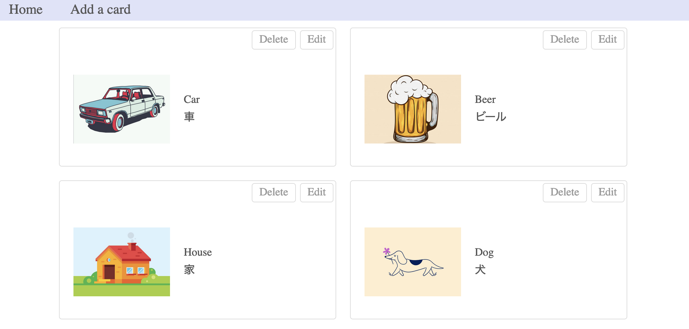

# Flash Card App

This app is for learning words.  
You can create your own flash cards!



## Installation

Clone this repository

```
git clone https://github.com/makokusuda/short-story.git
```

Install dependencies

```
npm install
```

## Usage

Create database

```
npm run create
```

Run server

```
npm run server
```

Run client

```
npm run start
```

Visit `http://localhost:8080/#/`
